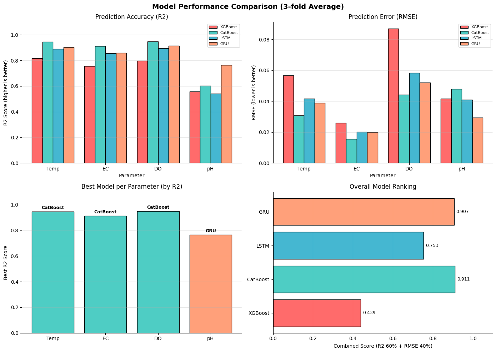

# 🌊 Chao Phraya River — Water Quality Forecasting Benchmark

> **Collaborative Research · 2024**  
> Benchmarked XGBoost · CatBoost · LSTM · GRU on 10-year Chao Phraya River time-series data, alongside ECE Master's students at KMITL.

---

## 📌 Project Overview

This repository contains the full machine learning pipeline for forecasting water quality parameters in the **Chao Phraya River** (Makham Station), sourced from the **Metropolitan Waterworks Authority (MWA)**. The project is part of a broader IoT-based water quality monitoring system published at **IEECON 2025**.

We benchmark four models across four parameters using rigorous **3-Fold Cross-Validation**:

| Parameter | Unit | Description |
|---|---|---|
| **Temperature (Temp)** | °C | Water temperature |
| **Electrical Conductivity (EC)** | µS/cm | Ion concentration proxy |
| **Dissolved Oxygen (DO)** | mg/L | Aquatic health indicator |
| **pH** | — | Acidity/alkalinity level |

---

## 🏆 Results Summary

> *Metrics averaged over 3-fold cross-validation. R² higher is better; RMSE/MAE/MSE lower is better.*

### R² Score Comparison (3-Fold Average)

| Model | Temp | EC | DO | pH |
|---|---|---|---|---|
| **CatBoost** | **0.9453** | **0.9127** | **0.9477** | 0.6033 |
| GRU | 0.9040 | 0.8599 | 0.9140 | **0.7643** |
| LSTM | 0.8901 | 0.8564 | 0.8936 | 0.5398 |
| XGBoost | 0.8169 | 0.7558 | 0.7975 | 0.5590 |

### RMSE Comparison (3-Fold Average)

| Model | Temp | EC | DO | pH |
|---|---|---|---|---|
| **CatBoost** | **0.0308** | **0.0157** | **0.0443** | 0.0477 |
| GRU | 0.0393 | 0.0199 | 0.0519 | **0.0292** |
| LSTM | 0.0416 | 0.0203 | 0.0584 | 0.0409 |
| XGBoost | 0.0566 | 0.0260 | 0.0876 | 0.0416 |

### 🥇 Best Model per Parameter

| Parameter | Best Model | R² |
|---|---|---|
| Temperature | **CatBoost** | 0.9453 |
| Electrical Conductivity | **CatBoost** | 0.9127 |
| Dissolved Oxygen | **CatBoost** | 0.9477 |
| pH | **GRU** | 0.7643 |

### Overall Model Ranking (Combined Score: R² 60% + RMSE 40%)

| Rank | Model | Score |
|---|---|---|
| 🥇 1 | **CatBoost** | 0.911 |
| 🥈 2 | **GRU** | 0.907 |
| 🥉 3 | **LSTM** | 0.753 |
| 4 | XGBoost | 0.439 |

---

> 📊 **Results Visualization**
>



---

## 💡 Key Findings

**Why did CatBoost outperform LSTM and GRU?**

Despite the conventional expectation that deep learning excels at time-series forecasting, **CatBoost with Optuna hyperparameter tuning achieved the highest overall accuracy**. The explanation aligns with the classic data volume vs. model performance curve:

- 📉 **Limited data**: 10 years of daily data (~3,650 rows after cleaning) falls in the regime where traditional ML is competitive with or superior to deep learning
- ⚙️ **Efficient tuning**: Optuna AutoML efficiently searched CatBoost's hyperparameter space; deep learning models have far more parameters and are harder to tune
- 📈 **Linear-friendly targets**: Temp, EC, DO show relatively smooth temporal patterns that gradient boosting handles well
- 🌀 **pH exception**: GRU captured complex pH dynamics better — a non-linear, harder-to-predict parameter where sequential memory helps

> **Short-term**: CatBoost wins due to data constraints and ease of tuning  
> **Long-term**: As data volume grows, LSTM/GRU are expected to eventually surpass CatBoost

---

## 📁 Repository Structure

```
chaophraya-water-quality/
│
├── README.md                          ← You are here
├── LICENSE                            ← MIT License
│
├── data/
│   └── makam.xlsx                     ← Raw 10-year dataset from MWA
│
├── notebooks/
│   ├── 01_XGBoost_ChaoPhraya.ipynb    ← XGBoost + Optuna baseline
│   ├── 02_CatBoost_ChaoPhraya.ipynb   ← CatBoost + Optuna (best overall)
│   ├── 03_LSTM_ChaoPhraya.ipynb       ← LSTM deep learning model
│   └── 04_GRU_ChaoPhraya.ipynb        ← GRU deep learning model
│
├── assets/
│   └── model_comparison_chart.png     ← Benchmark chart (place here)
│ 
│
├── paper/
│   └── IEECON2025_Water_Quality.pdf   ← Published paper (IEECON 2025)
│
└── requirements.txt                   ← Python dependencies
```

---

## 🔬 Methodology

### Data Pipeline

```
Raw MWA Data (makam.xlsx)
        │
        ▼
   Data Cleaning
   ├── Remove out-of-range sensor errors
   │   ├── Temp: realistic river range (15–40°C)
   │   ├── EC: remove zero/negative values
   │   ├── DO: remove physically impossible readings
   │   └── pH: remove values outside 4–11 range
   ├── Interpolate missing values (linear avg of neighbors)
   └── Drop irrelevant columns (TDS, salinity, turbidity, etc.)
        │
        ▼
  Feature Engineering
   ├── Time-based features: hour, day_of_week, month, season
   ├── Lag features: t-1, t-2, t-3, t-7, t-14 for each parameter
   ├── Rolling statistics: 7-day and 30-day mean/std
   └── Thai holiday/seasonal flags (monsoon, dry, cool seasons)
        │
        ▼
  Min-Max Normalization → [0, 1]
        │
        ▼
  3-Fold Time-Series Cross-Validation
  (respects temporal ordering — no data leakage)
        │
        ▼
  Model Training & Evaluation
  (R², MAE, RMSE, MSE per fold → averaged)
```

### Models

| Model | Type | Key Config |
|---|---|---|
| **XGBoost** | Gradient Boosting | Optuna tuning, lag + seasonal features |
| **CatBoost** | Gradient Boosting | Optuna tuning, native categorical support |
| **LSTM** | Recurrent Neural Net | Sequence window: 30 days, 2 layers |
| **GRU** | Recurrent Neural Net | Sequence window: 30 days, 2 layers |

### Evaluation Metrics

- **R²** (Coefficient of Determination) — closer to 1 is better
- **MAE** (Mean Absolute Error) — closer to 0 is better
- **RMSE** (Root Mean Squared Error) — closer to 0 is better
- **MSE** (Mean Squared Error) — closer to 0 is better

---

## 🚀 Getting Started

### Prerequisites

```bash
Python >= 3.9
```

### Installation

```bash
git clone https://github.com/<your-username>/chaophraya-water-quality.git
cd chaophraya-water-quality
pip install -r requirements.txt
```

### Run Notebooks

Open any notebook in `notebooks/` using Jupyter:

```bash
jupyter notebook notebooks/02_CatBoost_ChaoPhraya.ipynb
```

Or use Google Colab — each notebook is self-contained.

---

## 📦 Requirements

```
pandas>=2.0
numpy>=1.24
scikit-learn>=1.3
xgboost>=2.0
catboost>=1.2
optuna>=3.4
tensorflow>=2.13       # for LSTM & GRU
torch>=2.0             # optional alternative
matplotlib>=3.7
seaborn>=0.12
openpyxl>=3.1
jupyter
```

---

## 📄 Related Publication

This work is conducted alongside a paper published at **IEECON 2025**:

> T. Jomjaiekachorn, T. Anuwongpinit, B. Purahong,  
> **"IoT-based Water Quality Monitoring Station and Forecasting System with Machine Learning"**  
> *IEECON 2025, King Mongkut's Institute of Technology Ladkrabang, Bangkok, Thailand*

The paper covers the full IoT system architecture (Siemens SIMATIC IOT2050, RS485 Modbus RTU, AWS IoT Core, Node-RED, MQTT) alongside an initial LSTM vs. XGBoost comparison. **This repository extends that work** with CatBoost and GRU benchmarks using k-fold cross-validation.

---

## 🏫 Affiliation

**King Mongkut's Institute of Technology Ladkrabang (KMITL)**  
Department of Internet of Things & Information Engineering (IoTE)  
School of Engineering · Bangkok, Thailand

---

## 📜 License

This project is licensed under the **MIT License** — see [LICENSE](LICENSE) for details.

Data sourced from the **Metropolitan Waterworks Authority (MWA)** open data portal.  
Original dataset: [MWA Open Data — Makham Station](https://opendata.mwa.co.th/dataset/93547c14-4522-4c28-8289-170857998a70)

---

## 🤝 Acknowledgements

- Metropolitan Waterworks Authority (MWA) for open water quality data
- King Mongkut's Institute of Technology Ladkrabang [Grant 2565-02-01-093]
- ECE Master's students at KMITL for collaborative benchmarking

---

*Built with 🌊 and Python at KMITL IoTE · 2024*
